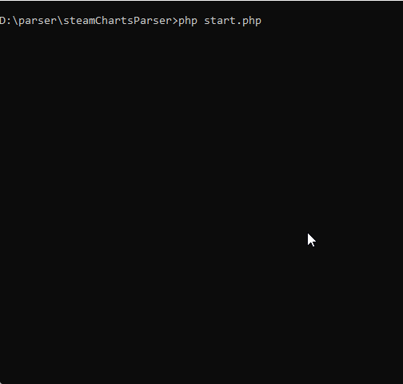

# 🕹 SteamCharts Parser

## 🧩 Description

A simple PHP-based parser for *SteamCharts* that collects current online and historical player statistics for selected games.

The script reads a list of URLs (SteamCharts game pages), fetches each one, and extracts:

- current online;
- max online per day;
- average online per month.

Result can be shown in console, saved as JSON, or both.  
The parser also includes detailed logging and support for curl cookies.

## 🖋 Features

- parsing current/peak/average online statistics;
- support for multiple game URLs via urls.txt;
- console interactive interface;
- optional JSON result export;
- logs of all curl and HTTP errors;
- optional logs of successful requests;
- automatic cookie saving for stable scraping;
- error handling with custom exceptions.

## 📸 Demonstration

## 📸 Screenshots - Additional screenshots can find in same folder: /screenshots/

## ⚙️ Technologies

- **PHP 8+** — core logic  
- **cURL** — HTTP requests  
- **DOMDocument + XPath** — HTML parsing  
- **JSON extension** — exporting results  
- **Console I/O** — simple UI interface  

## 📁 File Structure

- **start.php** — user interface (console prompts, output modes)  
- **parser.php** — main parser logic  
- **urls.txt** — list of game URLs to parse  

Generated after running:

- **parser.log** — logs of errors (curl/HTTP) and optionally successful requests  
- **cookies.txt** — cookie jar used by curl  
- **scJSON.json** — JSON results (if JSON mode selected)

To switch off success url parsing info:  
Open `parser.php` and comment the line:
#logParse('OK', 'Curl is ok', ['url' => $url, 'details' => $curlDetails]);

## ➕ Adding More Games

1) Go to https://steamcharts.com;

2) Find a game and open its full page
- Example: https://steamcharts.com/app/730

3) Copy the URL;

4) Paste it into urls.txt (one URL per line);

5) Done — the script will parse it on the next launch.

## ▶️ Running the Script
1) To start script: open console -> go to parser folder and start: php start.php

2) You will be asked how to display results:

- console

- JSON

- both
3) Make your choice.

## 🛠 Requirements
1) Windows:

Check your php.ini:

extension=curl
extension=openssl
extension_dir="ext"

!If you see SSL certificate errors (“SSL certificate problem”):

- Download cacert.pem from https://curl.se/ca/cacert.pem

- Save it into your PHP folder

- Add to php.ini:
curl.cainfo="PATH\\php\\cacert.pem"
openssl.cafile="PATH\\php\\cacert.pem"

2) Linux (Ubuntu/Debian):
sudo apt update
sudo apt install php-curl

!Or for specific PHP versions:

sudo apt install php8.1-curl

3) macOS
brew install php
